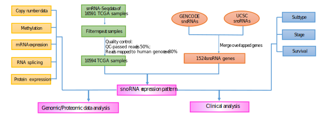

# SNORic

> [A Pan-cancer Analysis of the Expression and Clinical Relevance of Small Nucleolar RNAs in Human Cancer.](http://www.cell.com/cell-reports/fulltext/S2211-1247\(17\)31533-4)

>Jing Gong †, Yajuan Li †, Chun-Jie Liu †, Yu Xiang †, Chunlai Li, Youqiong Ye, Zhao Zhang, David H. Hawke, Peter K. Park, Lixia Diao, John A. Putkey, Liuqing Yang, An-Yuan Guo \*, Chunru Lin\*, Leng Han \*. Cell Reports. (2017).

# Introduction

The **SNORic** refers to "snoRNA in cancers". Small nucleolar RNAs (snoRNAs) are a class of regulatory non-coding RNAs, which play a conserved role in ribosome biogenesis. However, in recent years, increasing evidence has demonstrated that snoRNAs play important roles in tumorigenesis. Here, we systematically analyzed snoRNA expression profiles in > 10,000 samples across 31 cancer types from The Cancer Genome Atlas, and analyzed their correlation with other TCGA genomic, proteomic, epigenomic and clinical data (e.g. patient tumor stage, subtype, and survival).

# Workflow

